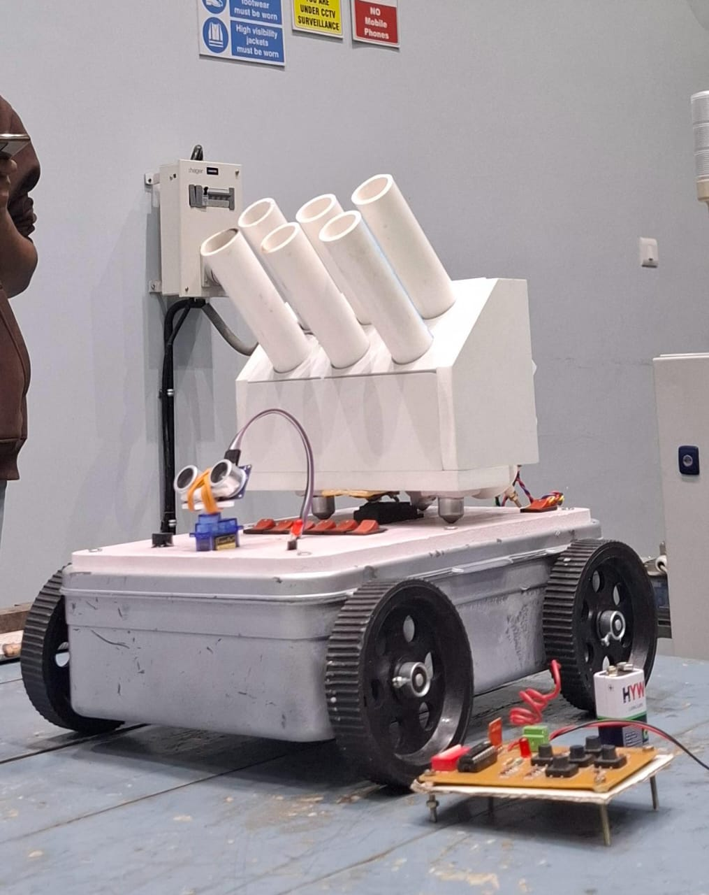
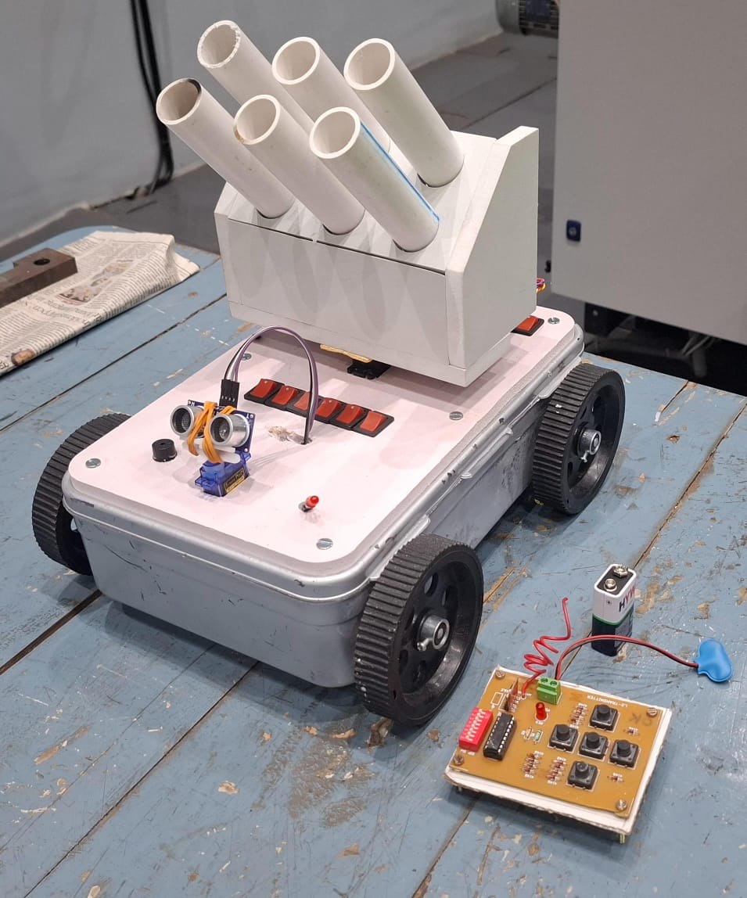
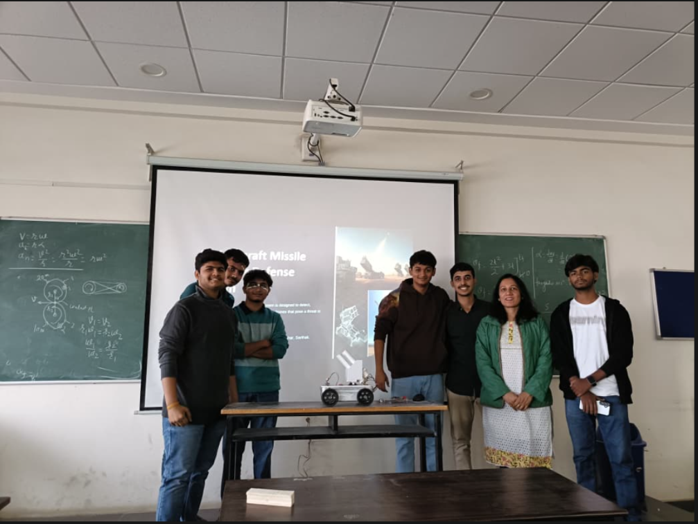
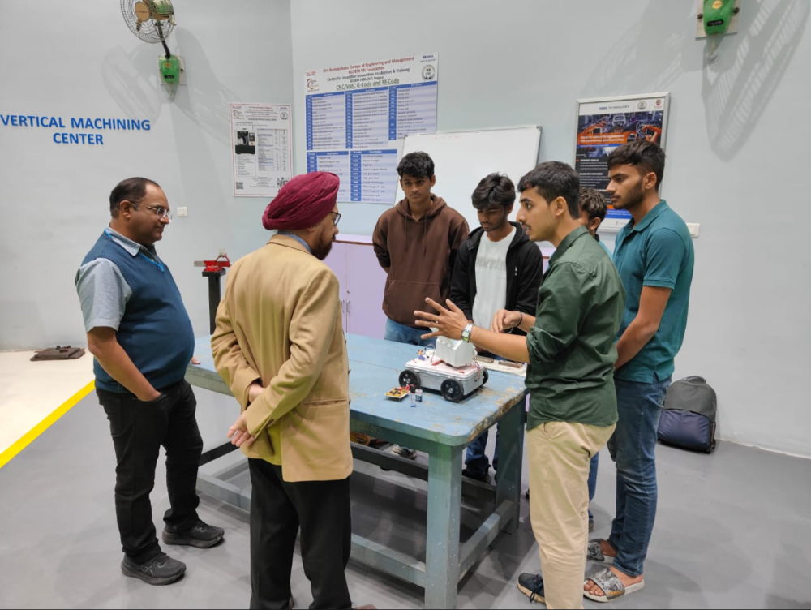

# Missile Launcher Rover

A remote-controlled tracked rover with a 6-tube launcher and ultrasonic targeting, built with a team of 6 as our 1st-semester engineering project at Ramdeobaba University.

## What it is

A small mobile platform on tracks that carries a multi-tube launcher. The rover is driven over RF remote, an ultrasonic sensor on the front handles range/target detection, and a servo handles aiming. Firing is done with a nichrome wire ignition setup — current heats the wire to release each projectile from its tube.

We called it the "Anti-Aircraft Missile Launcher Defense System" in the presentation because that's the concept it was inspired by, but functionally it's a remote-operated robotic platform with a multi-tube launcher.

## How it works

- Arduino Uno reads inputs from the RF receiver and the ultrasonic sensor
- Motor driver circuit runs the DC motors that turn the tracks
- A servo aims the launcher (elevation)
- Each launch tube has a nichrome wire wrapped in a ceramic-bead holder; firing energizes the wire and the heat releases the projectile
- Power comes from a 12V 1.3Ah sealed lead-acid battery
- The transmitter is a custom RF PCB with push buttons for drive, aim, and fire

## Hardware

- Arduino Uno (ATmega328P)
- 6× DC geared motors (track drive)
- HC-SR04 ultrasonic sensor
- SG90 servo motor (launcher elevation)
- Custom RF transmitter PCB (buttons for drive/aim/fire)
- RF receiver module
- Nichrome wire + ceramic bead holders (firing mechanism)
- 12V 1.3Ah sealed lead-acid battery
- Buzzer, LEDs
- 6 PVC pipe launch tubes mounted on a wooden frame
- Tracked chassis with wheels and rubber treads

## Problems we ran into

**Nichrome wire overheating.** The firing wire was getting too hot and damaging the surrounding material. We fixed it by mounting the wire inside ceramic beads — ceramic is a poor conductor of heat and electricity, so it isolates the heat from the rest of the launcher.

**Launcher was too heavy.** The original wooden launch pad with 6 pipes weighed down the chassis and stressed the motors. We rebuilt the pad with a 7mm wooden sheet, which cut the weight enough for the rover to move properly.

## Photos

| | |
|---|---|
|  |  |
| Final presentation in class | Demonstrating the rover to faculty |

## Project presentation

The full slide deck is in [project-presentation.pdf](project-presentation.pdf).

## Team

Built by 6 students as a 1st-semester engineering team project: Atharva, Yuvraj, Verma, Rajveer, Tushar, and myself.

## What I'd do differently now

- Cleaner wiring inside the chassis — it became hard to debug
- Add a current-limiting circuit for the nichrome firing pulse so heat is predictable
- Use a proper ESP32 with Wi-Fi/Bluetooth control instead of the RF buttons
- Lighter chassis material (acrylic or 3D-printed parts) to reduce strain on motors

## License

MIT
